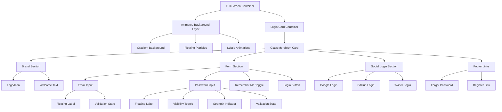
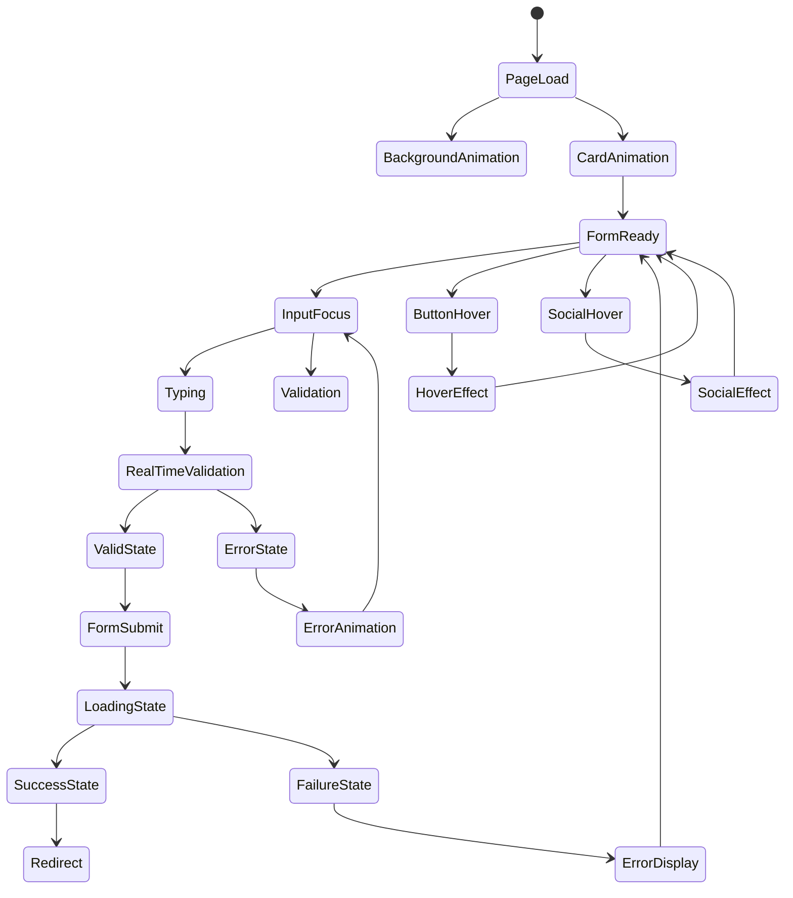
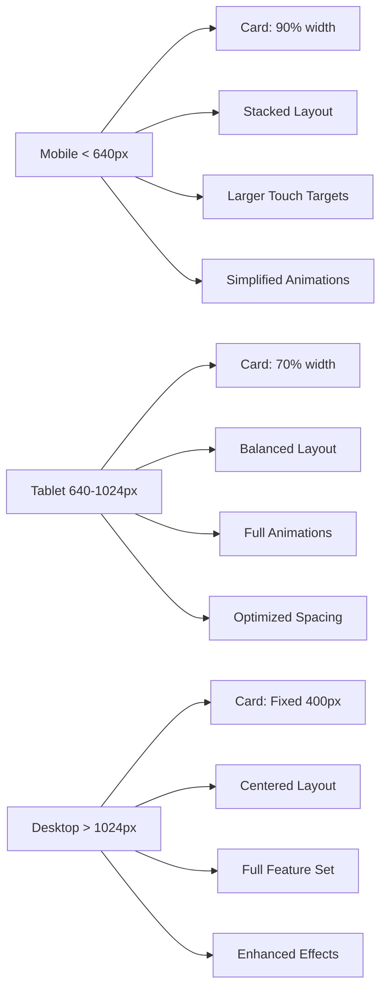
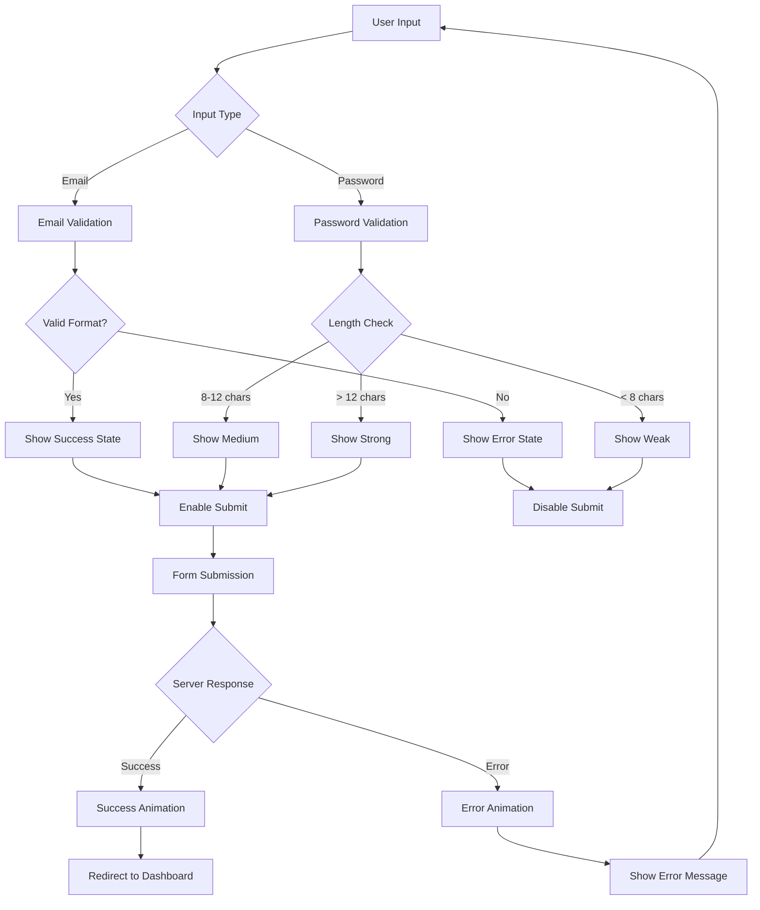
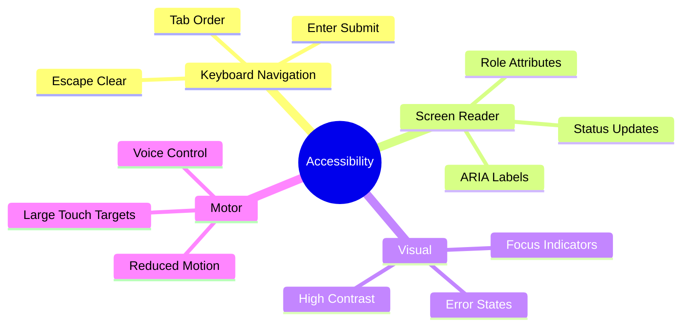
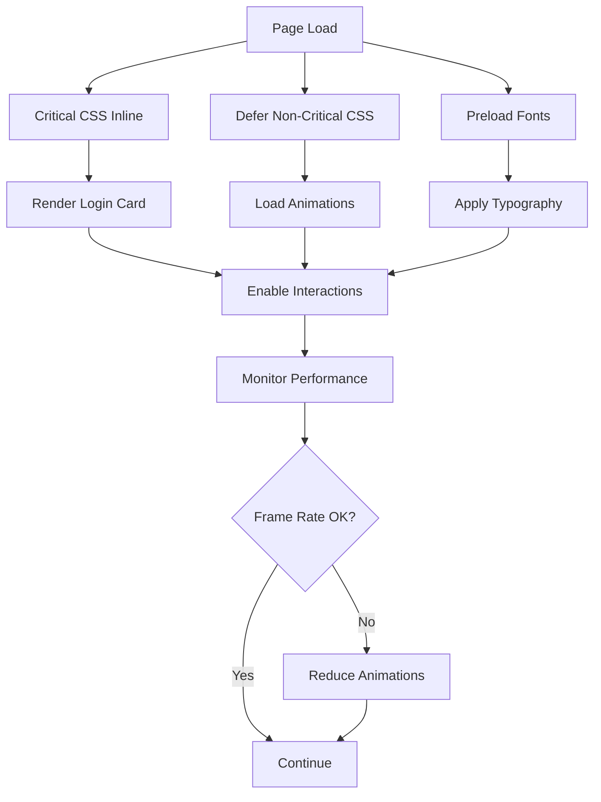

# Login Page Visual Mockup & Component Flow

## Page Layout Diagram



## Component State Flow



## Animation Timeline

```mermaid
gantt
    title Login Page Animation Sequence
    dateFormat X
    axisFormat %Ls
    
    section Page Load
    Background Fade In    :0, 500
    Card Slide Up        :200, 700
    Card Scale In        :200, 700
    
    section Form Elements
    Logo Appear          :400, 600
    Welcome Text         :500, 700
    Email Input          :600, 800
    Password Input       :700, 900
    Remember Me          :800, 1000
    Login Button         :900, 1100
    Social Buttons       :1000, 1200
    Footer Links         :1100, 1300
    
    section Interactions
    Hover Effects        :1300, 10000
    Focus Animations     :1300, 10000
    Validation Feedback  :1300, 10000
```



## Responsive Breakpoint Layout



## Form Validation Flow



## Color Scheme Visualization

### Primary Palette
- **Background Gradient**: `#0f172a` → `#1e1b4b` → `#312e81`
- **Card Background**: `rgba(255, 255, 255, 0.1)` with backdrop blur
- **Primary Button**: `#6366f1` → `#4f46e5` gradient
- **Text Primary**: `#f8fafc`
- **Text Secondary**: `#cbd5e1`

### State Colors
- **Success**: `#10b981` (Emerald-500)
- **Error**: `#ef4444` (Red-500)
- **Warning**: `#f59e0b` (Amber-500)
- **Focus**: `#a5b4fc` (Indigo-300)

## Interactive Elements Specification

### Input Fields
```
┌─────────────────────────────────────┐
│  Email Address              ↗       │  ← Floating Label
│  user@example.com                   │  ← Input Text
│                                 ✓   │  ← Validation Icon
└─────────────────────────────────────┘
```

### Password Field
```
┌─────────────────────────────────────┐
│  Password                   👁  ↗    │  ← Visibility Toggle
│  ••••••••••••                       │  ← Masked Input
│  ████████░░ Strong                  │  ← Strength Indicator
└─────────────────────────────────────┘
```

### Login Button States
```
Normal:    [    Login    ]
Hover:     [  ↗ Login ↖  ]  (slight scale up)
Loading:   [  ⟳ Logging in...  ]
Success:   [  ✓ Success!  ]
```

## Accessibility Features Map



## Performance Optimization Strategy



This visual mockup and component flow documentation provides a clear blueprint for implementing the modern login page. The diagrams show the relationship between components, animation sequences, and user interaction flows that will guide the development process.